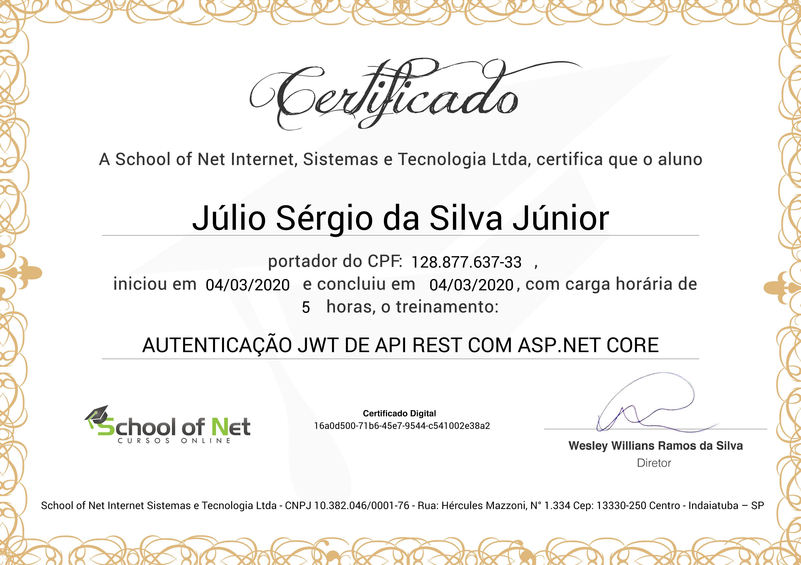

# Autenticação JWT de API REST com ASP.NET Core
## [School of Net](https://www.schoolofnet.com)

* API Rest
* ASP.NET Core
* JWT

Instrutor: Victor Lima
"Neste curso você vai continuar aprendendo a como desenvolver API Rest com ASP.NET core, dessa vez você vai aprender a como fazer a autenticação da API usando JWT(Json web token)."

